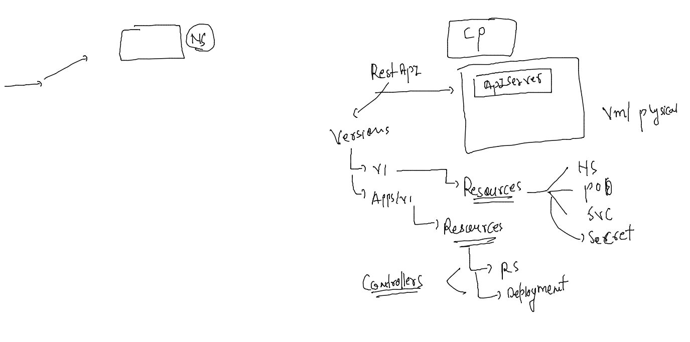
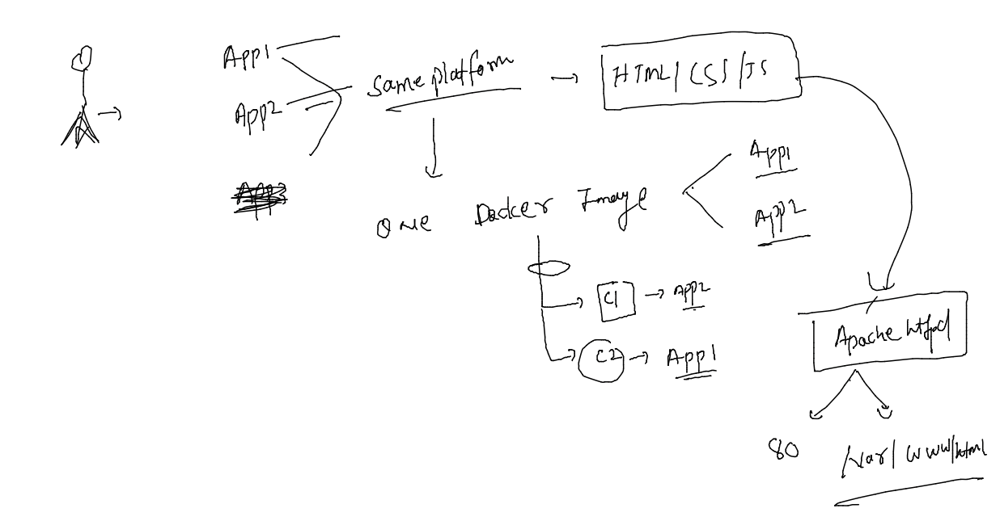
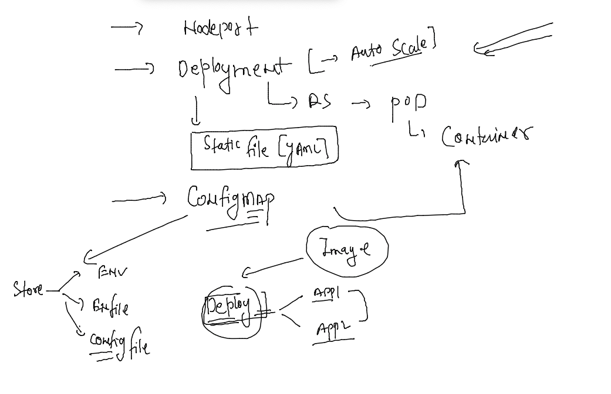
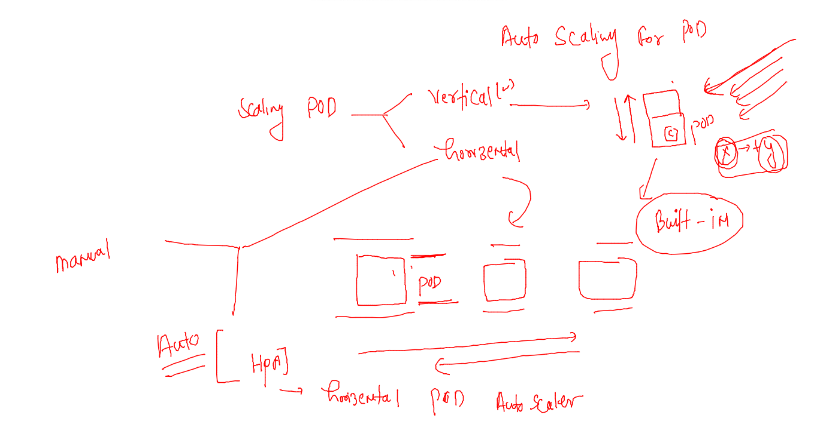
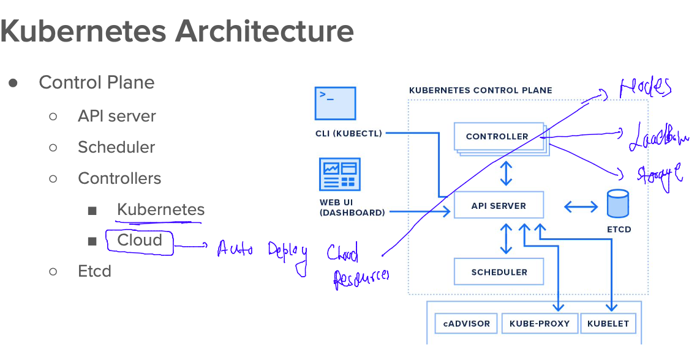
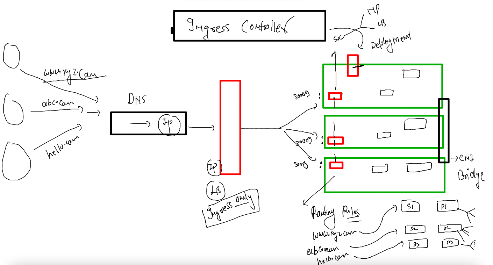
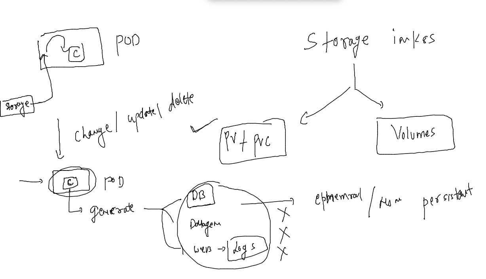

# Training plan 


### k8s in overall 



### customer multiple app 



### Deployment with configMap and Auto scaling in k8s 



## creating deployment YAMLS 

### creating Deployment 

```
kubectl create  deployment  ashucustomerapp --image=dockerashu/oracleapp:v1  --port   80  --dry-run=client -o yaml  >deployment.yaml
```

### creating configMap 

```
kubectl create configmap appenv  --from-literal deploy=app1 --dry-run=client -o yaml  >config.yaml 
```

### calling Env in Deployment yaml 

```
apiVersion: apps/v1
kind: Deployment
metadata:
  creationTimestamp: null
  labels:
    app: ashucustomerapp
  name: ashucustomerapp
spec:
  replicas: 1
  selector:
    matchLabels:
      app: ashucustomerapp
  strategy: {}
  template: # for creating pod 
    metadata:
      creationTimestamp: null
      labels:
        app: ashucustomerapp
    spec:
      containers:
      - image: dockerashu/oracleapp:v1
        name: oracleapp
        ports:
        - containerPort: 80
        envFrom: # taking env from somewhere 
        - configMapRef: # from Configmap 
            name: appenv # name of configmap 
        resources: {}
status: {}

```

### creating nodeport service 

```
kubectl create  service nodeport ashulb1 --tcp 1234:80  --dry-run=client -o yaml >nodeport.yaml
```

### updating pod label in service yaml 

```
apiVersion: v1
kind: Service
metadata:
  creationTimestamp: null
  labels:
    app: ashulb1
  name: ashulb1
spec:
  ports:
  - name: 1234-80
    port: 1234
    protocol: TCP
    targetPort: 80
  selector: # using label of pod to find 
    app: ashucustomerapp # this is label my deployemnt pod section 
  type: NodePort
status:
  loadBalancer: {}

```

### lets deploy it 

```
[ashu@docker-host customer-app-deploy]$ kubectl  apply -f  . 
configmap/appenv configured
deployment.apps/ashucustomerapp created
service/ashulb1 configured
[ashu@docker-host customer-app-deploy]$ kubectl get deploy
NAME              READY   UP-TO-DATE   AVAILABLE   AGE
ashucustomerapp   1/1     1            1           30s
[ashu@docker-host customer-app-deploy]$ kubectl get rs
NAME                         DESIRED   CURRENT   READY   AGE
ashucustomerapp-7fdbb87555   1         1         1       36s
[ashu@docker-host customer-app-deploy]$ kubectl get po
NAME                               READY   STATUS    RESTARTS   AGE
ashucustomerapp-7fdbb87555-jkr6q   1/1     Running   0          40s
[ashu@docker-host customer-app-deploy]$ kubectl get cm
NAME               DATA   AGE
appenv             1      78s
kube-root-ca.crt   1      24h
[ashu@docker-host customer-app-deploy]$ kubectl get svc
NAME      TYPE       CLUSTER-IP      EXTERNAL-IP   PORT(S)          AGE
ashulb1   NodePort   10.104.145.51   <none>        1234:30004/TCP   84s
[ashu@docker-host customer-app-deploy]$ kubectl get ep
NAME      ENDPOINTS            AGE
ashulb1   192.168.216.127:80   89s
```

### if we change in configmap for ENV -- then to update deployment we can using rolling updates 

```
[ashu@docker-host customer-app-deploy]$ kubectl apply -f config.yaml 
configmap/appenv configured
[ashu@docker-host customer-app-deploy]$ kubectl rollout restart deployment ashucustomerapp 
deployment.apps/ashucustomerapp restarted
[ashu@docker-host customer-app-deploy]$ kubectl  get  po 
NAME                               READY   STATUS        RESTARTS   AGE
ashucustomerapp-7c7fc9f5d8-jlf7k   1/1     Running       0          6s
ashucustomerapp-7fdbb87555-m2skf   1/1     Terminating   0          93s
[ashu@docker-host customer-app-deploy]$ 


```
### HPA in k8s 



### deployment with restricted vertical scaling 

```
apiVersion: apps/v1
kind: Deployment
metadata:
  creationTimestamp: null
  labels:
    app: ashucustomerapp
  name: ashucustomerapp
spec:
  replicas: 1
  selector:
    matchLabels:
      app: ashucustomerapp
  strategy: {}
  template: # for creating pod 
    metadata:
      creationTimestamp: null
      labels: # labels of pod 
        app: ashucustomerapp
    spec:
      containers:
      - image: dockerashu/oracleapp:v1
        name: oracleapp
        ports:
        - containerPort: 80
        envFrom: # taking env from somewhere 
        - configMapRef: # from Configmap 
            name: appenv # name of configmap 
        resources: # dynamic resources 
          requests:
            memory: 200M 
            cpu: 100m # 1vcpu === 1000 Milicore 
          limits: 
            memory: 400M 
            cpu: 300m 
status: {}

```

### lets redeploy deployment 

```
ashu@docker-host customer-app-deploy]$ kubectl apply -f deployment.yaml 
deployment.apps/ashucustomerapp configured
[ashu@docker-host customer-app-deploy]$ kubectl  get po 
NAME                               READY   STATUS        RESTARTS   AGE
ashucustomerapp-5c78756686-gbp4t   1/1     Running       0          3s
ashucustomerapp-5d4f579f7b-b7p2n   1/1     Terminating   0          47m
[ashu@docker-host customer-app-deploy]$ 

```

### implementing autoscaling 

```
[ashu@docker-host customer-app-deploy]$ kubectl get deploy 
NAME              READY   UP-TO-DATE   AVAILABLE   AGE
ashucustomerapp   1/1     1            1           77m
[ashu@docker-host customer-app-deploy]$ kubectl autoscale deployment ashucustomerapp --min=3  --max=10   --cpu-percent 80  --dry-run=client -o yaml  >hpa.yaml 
[ashu@docker-host customer-app-deploy]$ kubectl apply -f hpa.yaml 
horizontalpodautoscaler.autoscaling/ashucustomerapp created
[ashu@docker-host customer-app-deploy]$ kubectl get  hpa
NAME              REFERENCE                    TARGETS         MINPODS   MAXPODS   REPLICAS   AGE
ashucustomerapp   Deployment/ashucustomerapp   <unknown>/80%   3         10        0          6s
[ashu@docker-host customer-app-deploy]$ kubectl get deployments
NAME              READY   UP-TO-DATE   AVAILABLE   AGE
ashucustomerapp   1/1     1            1           78m
```

### hpa 

```
[ashu@docker-host customer-app-deploy]$ kubectl get hpa
NAME              REFERENCE                    TARGETS   MINPODS   MAXPODS   REPLICAS   AGE
ashucustomerapp   Deployment/ashucustomerapp   1%/80%    3         10        3          2m9s
[ashu@docker-host customer-app-deploy]$ 
```

### CLoud controller in k8s 



### loadbalancer service 

```
ashu@docker-host customer-app-deploy]$ kubectl expose deployment ashucustomerapp --type LoadBalancer  --port 80 --name x1

Error from server (AlreadyExists): services "x1" already exists
[ashu@docker-host customer-app-deploy]$ kubectl get  svc 
NAME      TYPE           CLUSTER-IP      EXTERNAL-IP   PORT(S)          AGE
ashulb1   NodePort       10.104.145.51   <none>        1234:30004/TCP   137m
x1        LoadBalancer   10.99.7.7       <pending>     80:32586/TCP     14s
[ashu@docker-host customer-app-deploy]$ 
```

### Ingress in k8s 



### nginx ingress controller 

```
[ashu@docker-host ~]$ kubectl apply -f https://raw.githubusercontent.com/kubernetes/ingress-nginx/controller-v1.3.0/deploy/static/provider/baremetal/deploy.yaml
namespace/ingress-nginx created
serviceaccount/ingress-nginx created
serviceaccount/ingress-nginx-admission created
role.rbac.authorization.k8s.io/ingress-nginx created
role.rbac.authorization.k8s.io/ingress-nginx-admission created
clusterrole.rbac.authorization.k8s.io/ingress-nginx created
clusterrole.rbac.authorization.k8s.io/ingress-nginx-admission created
rolebinding.rbac.authorization.k8s.io/ingress-nginx created
rolebinding.rbac.authorization.k8s.io/ingress-nginx-admission created
clusterrolebinding.rbac.authorization.k8s.io/ingress-nginx created
clusterrolebinding.rbac.authorization.k8s.io/ingress-nginx-admission created
configmap/ingress-nginx-controller created
service/ingress-nginx-controller created
service/ingress-nginx-controller-admission created
deployment.apps/ingress-nginx-controller created
job.batch/ingress-nginx-admission-create created
```

### in current deployment lets delete all svc and create only one 

```
[ashu@docker-host customer-app-deploy]$ kubectl  get deploy 
NAME              READY   UP-TO-DATE   AVAILABLE   AGE
ashucustomerapp   3/3     3            3           4h43m
[ashu@docker-host customer-app-deploy]$ kubectl  expose  deployment ashucustomerapp  --type ClusterIP --port 80 --name ashulbx1 
service/ashulbx1 exposed
[ashu@docker-host customer-app-deploy]$ kubectl  get  svc
NAME       TYPE        CLUSTER-IP       EXTERNAL-IP   PORT(S)   AGE
ashulbx1   ClusterIP   10.109.102.239   <none>        80/TCP    5s
[ashu@docker-host customer-app-deploy]$ 

```

### ingress rule 

```
apiVersion: networking.k8s.io/v1
kind: Ingress
metadata:
  name: ashu-webapp-route-rule # changed here 
  annotations:
    nginx.ingress.kubernetes.io/rewrite-target: /
spec:
  ingressClassName: nginx # changer 
  rules:
  - host: www.ashu.com  # add this line 
    http:
      paths:
      - path: / # on home page 
        pathType: Prefix
        backend:
          service:
            name: ashulbx1 # name of service 
            port:
              number: 80
```

### lets deploy it 

```
ashu@docker-host customer-app-deploy]$ kubectl apply -f ingress-rule.yaml 
ingress.networking.k8s.io/ashu-webapp-route-rule created
[ashu@docker-host customer-app-deploy]$ 
[ashu@docker-host customer-app-deploy]$ kubectl  get  ingress 
NAME                     CLASS   HOSTS          ADDRESS   PORTS   AGE
ashu-webapp-route-rule   nginx   www.ashu.com             80      9s
[ashu@docker-host customer-app-deploy]$ 

```

### storage in k8s 



## MYSQL DB deploy as Deployment 

```
kubectl create configmap db-details --from-literal MYSQL_USER="admin" --dry-run=client -o yaml >cm.yaml
===

apiVersion: v1
data:
  MYSQL_USER: admin
  MYSQL_DATABASE: oracleinfo
kind: ConfigMap
metadata:
  creationTimestamp: null
  name: db-details

```

### creating secret 

```
kubectl  create secret generic db-pass --from-literal sqlpass="Docker@098@" --dry-run=client  -o yaml  >secret.yaml 
```

### deploy it 

```
[ashu@docker-host mysql-db]$ ls
cm.yaml  secret.yaml
[ashu@docker-host mysql-db]$ kubectl  apply -f .
configmap/db-details created
secret/db-pass created
[ashu@docker-host mysql-db]$ kubectl  get  cm 
NAME               DATA   AGE
appenv             1      5h34m
db-details         2      5s
kube-root-ca.crt   1      29h
[ashu@docker-host mysql-db]$ kubectl  get  secret
NAME          TYPE                             DATA   AGE
ashuimg-sec   kubernetes.io/dockerconfigjson   1      28h
db-pass       Opaque                           1      8s
[ashu@docker-host mysql-db]$ 
```

### creating database deployment file

```
kubectl create deployment  ashudb --image=mysql --port 3306  --dry-run=client -o yaml  >deploy.yaml 
====

apiVersion: apps/v1
kind: Deployment
metadata:
  creationTimestamp: null
  labels:
    app: ashudb
  name: ashudb
spec:
  replicas: 1
  selector:
    matchLabels:
      app: ashudb
  strategy: {}
  template: # template section 
    metadata:
      creationTimestamp: null
      labels:
        app: ashudb
    spec:
      containers:
      - image: mysql
        name: mysql
        ports:
        - containerPort: 3306
        envFrom: # using configmap as env 
        - configMapRef:
            name: db-details
        env: # calling env to set value in ENv variable 
        - name: MYSQL_ROOT_PASSWORD
          valueFrom:
            secretKeyRef:
              name: db-pass
              key: sqlpass
        - name: MYSQL_PASSWORD
          valueFrom:
            secretKeyRef:
              name: db-pass
              key: sqlpass
        resources: {}
status: {}

```

### deploy it 

```
[ashu@docker-host mysql-db]$ kubectl apply -f deploy11.yaml 
deployment.apps/ashudb configured
[ashu@docker-host mysql-db]$ kubectl  get po
NAME                      READY   STATUS    RESTARTS   AGE
ashudb-64bcdb6c48-55xbv   1/1     Running   0          3s

```


