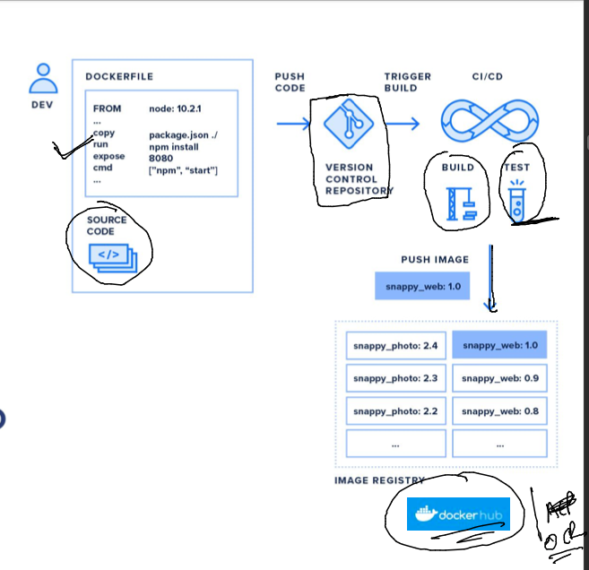
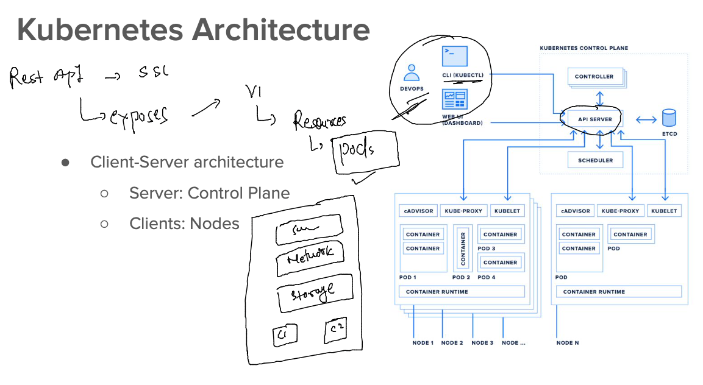
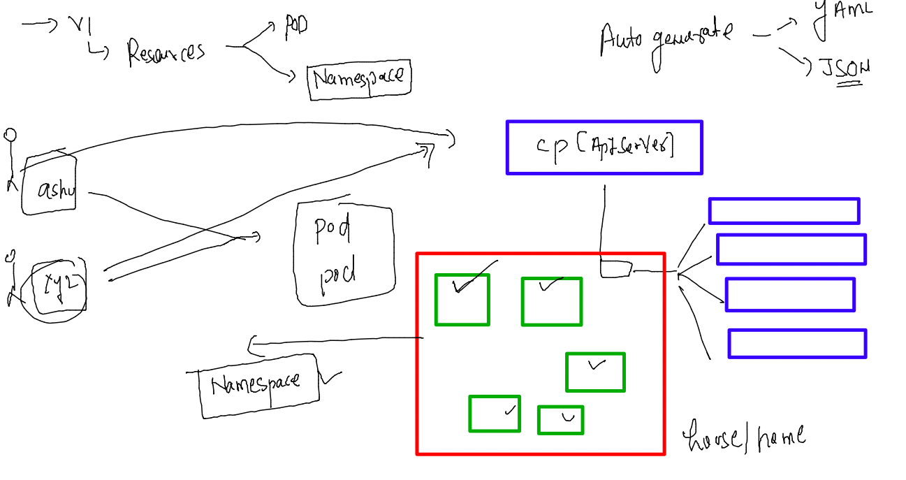
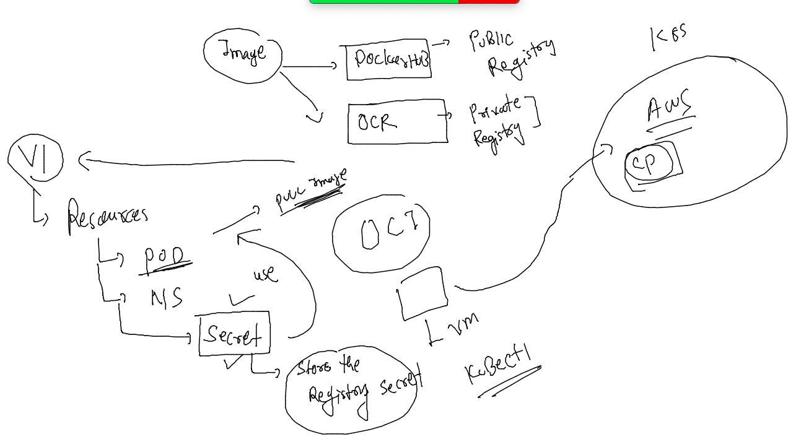
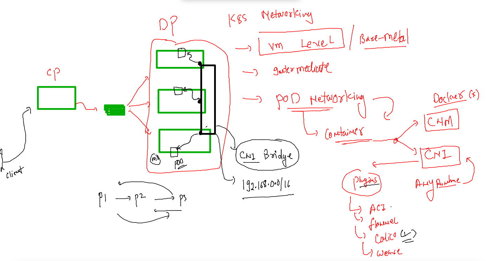
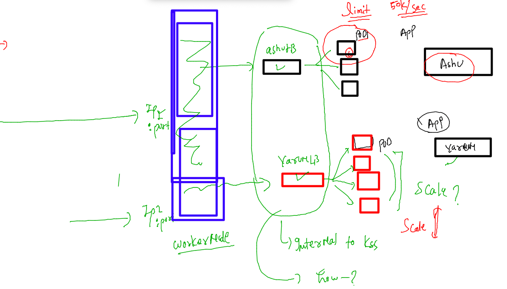
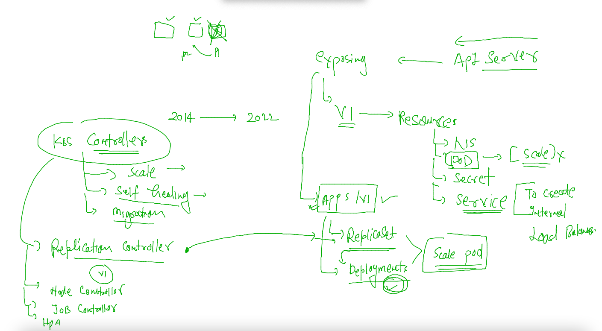
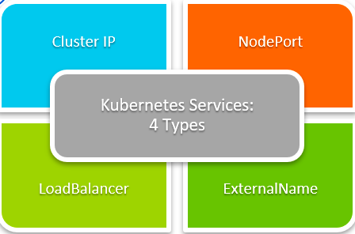
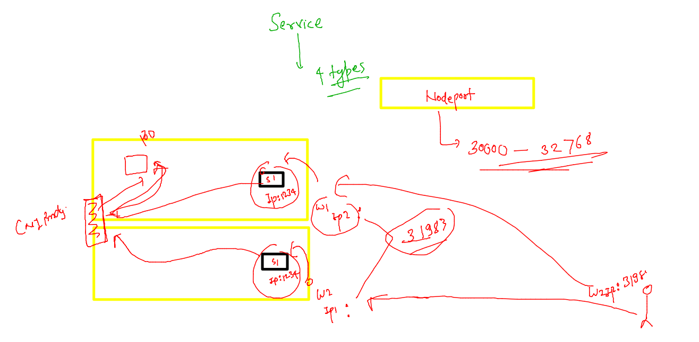

# Training plan 


## Revision 

### app containerization 



### app Deployment 



### Deletion of pods 

```
[ashu@docker-host ~]$ kubectl  delete pod  ashupod-123 
pod "ashupod-123" deleted
[ashu@docker-host ~]$
```

### deleting all the pdos 

```
[ashu@docker-host ~]$ kubectl delete pods --all
pod "chanpod-123" deleted
pod "eashupod-143" deleted
pod "kushpod-123" deleted
pod "omesh-pod-type-1" deleted
pod "palpod-123" deleted
[ashu@docker-host ~]$ kubectl  get  po
No resources found in default namespace.
[ashu@docker-host ~]$ 

```

### creating pod from cli 

```
[ashu@docker-host ashu-k8sapps]$ kubectl  run  ashupod2 --image=docker.io/dockerashu/ashuwebapp:frontendv1  --port 80  
pod/ashupod2 created
[ashu@docker-host ashu-k8sapps]$ kubectl  get  pods
NAME       READY   STATUS    RESTARTS   AGE
ashupod2   1/1     Running   0          4s
[ashu@docker-host ashu-k8sapps]$ 

```

### auto gen yaml / json 

```
[ashu@docker-host ashu-k8sapps]$ kubectl  run  ashupod2 --image=docker.io/dockerashu/ashuwebapp:frontendv1  --port 80  --dry-run=client  -o yaml 
apiVersion: v1
kind: Pod
metadata:
  creationTimestamp: null
  labels:
    run: ashupod2
  name: ashupod2
spec:
  containers:
  - image: docker.io/dockerashu/ashuwebapp:frontendv1
    name: ashupod2
    ports:
    - containerPort: 80
    resources: {}
  dnsPolicy: ClusterFirst
  restartPolicy: Always
status: {}
```

### store output in yaml file 

```
kubectl  run  ashupod2 --image=docker.io/dockerashu/ashuwebapp:frontendv1  --port 80  --dry-run=client  -o yaml  >ashupod2.yaml
```

### lets deploy it 

```
[ashu@docker-host ashu-k8sapps]$ ls
ashupod1.yaml  ashupod2.yaml
[ashu@docker-host ashu-k8sapps]$ kubectl  apply -f ashupod2.yaml 
pod/ashupod2 created
[ashu@docker-host ashu-k8sapps]$ kubectl  get  po
NAME         READY   STATUS    RESTARTS   AGE
ashupod2     1/1     Running   0          4s
gauravpod2   1/1     Running   0          3m25s
[ashu@docker-host ashu-k8sapps]$ kubectl  get  po -o wide
NAME         READY   STATUS    RESTARTS   AGE     IP               NODE          NOMINATED NODE   READINESS GATES
ashupod2     1/1     Running   0          9s      192.168.216.84   workernode2   <none>           <none>
gauravpod2   1/1     R
```

### capturing events in k8s for troubleshooting purpose 

```
  399  kubectl  get  events
  400  kubectl  get  events --field-selector  type!=Normal
```

### json format for POD instruction 

```
  404  kubectl  run  ashupod3 --image=docker.io/dockerashu/ashuwebapp:frontendv1  --port 80  --dry-run=client  -o json  
  405  kubectl  run  ashupod3 --image=docker.io/dockerashu/ashuwebapp:frontendv1  --port 80  --dry-run=client  -o json       >test.json 
  406  history 
[ashu@docker-host ~]$ kubectl  apply -f test.json 
pod/ashupod3 created
[ashu@docker-host ~]$ kubectl  get po 
NAME          READY   STATUS    RESTARTS   AGE
ashupod2      1/1     Running   0          10m
ashupod3      1/1     Running   0          4s
```

###  Creating a private space for individuals using Namespace 



### checking default namespaces in k8s 

```
[ashu@docker-host ~]$ kubectl  get  namespaces 
NAME              STATUS   AGE
default           Active   19h
kube-node-lease   Active   19h
kube-public       Active   19h
kube-system       Active   19h
[ashu@docker-host ~]$ 
[ashu@docker-host ~]$ kubectl  get  pods
No resources found in default namespace.
[ashu@docker-host ~]$ 
[ashu@docker-host ~]$ 
[ashu@docker-host ~]$ kubectl  get  pods  -n kube-system 
NAME                                       READY   STATUS    RESTARTS      AGE
calico-kube-controllers-555bc4b957-59tts   1/1     Running   1 (69m ago)   19h
calico-node-gjj79                          1/1     Running   1 (69m ago)   19h
calico-node-h2dsj                          1/1     Running   1 (69m ago)   19h
calico-node-kfhzg                          1/1     Running   1 (69m ago)   19h
coredns-6d4b75cb6d-8r6tz                   1/1     Running   1 (69m ago)   19h
coredns-6d4b75cb6d-bqctw                   1/1     Running   1 (69m ago)   19h


```

### creating custom namespaces

```
[ashu@docker-host ashu-k8sapps]$ kubectl  create  namespace  ashu-apps --dry-run=client -o yaml
apiVersion: v1
kind: Namespace
metadata:
  creationTimestamp: null
  name: ashu-apps
spec: {}
status: {}
[ashu@docker-host ashu-k8sapps]$ kubectl  create  namespace  ashu-apps --dry-run=client -o yaml >ns.yaml 
[ashu@docker-host ashu-k8sapps]$ ls
ashupod1.yaml  ashupod2.yaml  ns.yaml
[ashu@docker-host ashu-k8sapps]$ kubectl apply -f  ns.yaml 
namespace/ashu-apps created
[ashu@docker-host ashu-k8sapps]$ kubectl  get  namespaces 
NAME              STATUS   AGE
ashu-apps         Active   6s
default           Active   19h
kube-node-lease   Active   19h
kube-public       Active   19h
kube-system       Active   19h
```

### configure default namespace for user 

```
[ashu@docker-host ~]$ kubectl  get  pods
No resources found in default namespace.
[ashu@docker-host ~]$ kubectl  config set-context  --current --namespace ashu-apps  
Context "kubernetes-admin@kubernetes" modified.
[ashu@docker-host ~]$ 
[ashu@docker-host ~]$ kubectl  get  pods
No resources found in ashu-apps namespace.
[ashu@docker-host ~]$ 
[ashu@docker-host ~]$ kubectl config  get-contexts 
CURRENT   NAME                          CLUSTER      AUTHINFO           NAMESPACE
*         kubernetes-admin@kubernetes   kubernetes   kubernetes-admin   ashu-apps
[ashu@docker-host ~]$ 


```

### deploy pods 

```
[ashu@docker-host ashu-k8sapps]$ kubectl apply -f  ashupod1.yaml  -f ashupod2.yaml 
pod/ashupod-123 created
pod/ashupod2 created
[ashu@docker-host ashu-k8sapps]$ kubectl  get pod
NAME          READY   STATUS    RESTARTS   AGE
ashupod-123   1/1     Running   0          7s
ashupod2      1/1     Running   0          6s
```

### deploy pods in different namespace 

```
[ashu@docker-host ashu-k8sapps]$ kubectl apply -f  ashupod1.yaml  -f ashupod2.yaml -n default 
pod/ashupod-123 created
pod/ashupod2 created
[ashu@docker-host ashu-k8sapps]$ 
[ashu@docker-host ashu-k8sapps]$ 
[ashu@docker-host ashu-k8sapps]$ kubectl  get pod -n default 
NAME          READY   STATUS    RESTARTS   AGE
ashupod-123   1/1     Running   0          7s
ashupod2      1/1     Running   0          7s
[ashu@docker-host ashu-k8sapps]$ 
```

### defining namespace in YAML of POD 

```
[ashu@docker-host ashu-k8sapps]$ kubectl apply -f  ashupod1.yaml  -f ashupod2.yaml -n default 
pod/ashupod-123 created
pod/ashupod2 created
[ashu@docker-host ashu-k8sapps]$ 
[ashu@docker-host ashu-k8sapps]$ 
[ashu@docker-host ashu-k8sapps]$ kubectl  get pod -n default 
NAME          READY   STATUS    RESTARTS   AGE
ashupod-123   1/1     Running   0          7s
ashupod2      1/1     Running   0          7s
[ashu@docker-host ashu-k8sapps]$ 
```

### PRivate Docker image deploy in k8s 

```
kubectl run ashupod3 --image=phx.ocir.io/axmbtg8judkl/ashuwebapp:frontendv1   --port 80  --dry-run=client -o yaml >ocrpod.yaml 
[ashu@docker-host ashu-k8sapps]$ kubectl apply -f ocrpod.yaml 
pod/ashupod3 created
[ashu@docker-host ashu-k8sapps]$ kubectl  get  po 
NAME       READY   STATUS             RESTARTS   AGE
ashupod3   0/1     ImagePullBackOff   0          5s
[ashu@docker-host ashu-k8sapps]$ 

```

### understanding secret in k8s under apiVersion v1 



### creating secret to store ocr registry credential 

```
kubectl  create  secret  docker-registry  ashuimg-sec  --docker-server=phx.ocir.io   --docker-username=""  --docker-password=""  --dry-run=client  -o yaml >ocr_secret.yaml 

===
[ashu@docker-host ashu-k8sapps]$ kubectl  apply -f ocr_secret.yaml 
secret/ashuimg-sec created
[ashu@docker-host ashu-k8sapps]$ kubectl  get  secret  
NAME          TYPE                             DATA   AGE
ashuimg-sec   kubernetes.io/dockerconfigjson   1      10s
[ashu@docker-host ashu-k8sapps]$ 

```

### let's use it inside pod yaml file 

```
apiVersion: v1
kind: Pod
metadata:
  creationTimestamp: null
  labels:
    run: ashupod3
  name: ashupod3
spec:
  imagePullSecrets: # for calling secret 
  - name: ashuimg-sec # name of secret 
  containers:
  - image: phx.ocir.io/axmbtg8judkl/ashuwebapp:frontendv1
    name: ashupod3
    ports:
    - containerPort: 80
    resources: {}
  dnsPolicy: ClusterFirst
  restartPolicy: Always
status: {}

```

### replace after adding changes 

```
[ashu@docker-host ashu-k8sapps]$ kubectl replace  -f ocrpod.yaml --force 
pod "ashupod3" deleted
pod/ashupod3 replaced
[ashu@docker-host ashu-k8sapps]$ kubectl  get  po 
NAME       READY   STATUS    RESTARTS   AGE
ashupod3   1/1     Running   0          6s
[ashu@docker-host ashu-k8sapps]$ 
```

##  K8s networking 

### Understanding pod networking using {Container network internface [CNI]} model 



### list of CNI 

[list_of_cni](https://github.com/containernetworking/cni)

### pods can communicate to each other by Default 

```
[ashu@docker-host ~]$ kubectl  run  testpod --image=alpine  --command  sleep 100 
pod/testpod created
[ashu@docker-host ~]$ kubectl  get  po -o wide
NAME       READY   STATUS    RESTARTS   AGE   IP               NODE          NOMINATED NODE   READINESS GATES
ashupod3   1/1     Running   0          44m   192.168.212.45   workernode1   <none>           <none>
testpod    1/1     Running   0          4s    192.168.212.59   workernode1   <none>           <none>
[ashu@docker-host ~]$ kubectl  exec -it  testpod -- sh 
/ # ping 192.168.212.45
PING 192.168.212.45 (192.168.212.45): 56 data bytes
64 bytes from 192.168.212.45: seq=0 ttl=63 time=0.146 ms
64 bytes from 192.168.212.45: seq=1 ttl=63 time=0.084 ms
^C
--- 192.168.212.45 ping statistics ---
2 packets transmitted, 2 packets received, 0% packet loss
round-trip min/avg/max = 0.084/0.115/0.146 ms
/ # ping 192.168.216.75
PING 192.168.216.75 (192.168.216.75): 56 data bytes
64 bytes from 192.168.216.75: seq=0 ttl=62 time=0.595 ms
64 bytes from 192.168.216.75: seq=1 ttl=62 time=0.551 ms
^C
--- 192.168.216.75 ping statistics ---
2 packets transmitted, 2 packets received, 0% packet loss
round-trip min/avg/max = 0.551/0.573/0.595 ms
/ # ping 192.168.216.73
PING 192.168.216.73 (192.168.216.73): 56 data bytes
64 bytes from 192.168.216.73: seq=0 ttl=62 time=0.535 ms
64 bytes from 192.168.216.73: seq=1 ttl=62 time=0.561 ms
^C
--- 192.168.216.73 ping statistics ---
2 packets transmitted, 2 packets received, 0% packet loss
round-trip min/avg/max = 0.535/0.548/0.561 ms
/ # exit

```


### pod networking and internal Loadbalancers



### controller and service understanding 



### creating deployment 

```
 kubectl  create  deployment  ashudep1  --image=docker.io/dockerashu/ashuwebapp:frontendv1  --port 80  --dry-run=client  -o yaml >ashuapp_deploy.yaml
```

### lets deploy it 

```
[ashu@docker-host ashu-k8sapps]$ kubectl  apply -f  ashuapp_deploy.yaml 
deployment.apps/ashudep1 created
[ashu@docker-host ashu-k8sapps]$ kubectl  get  deployments
NAME       READY   UP-TO-DATE   AVAILABLE   AGE
ashudep1   1/1     1            1           9s
[ashu@docker-host ashu-k8sapps]$ kubectl  get  po
NAME                        READY   STATUS    RESTARTS   AGE
ashudep1-78fc8f55fb-7c5r5   1/1     Running   0          23s
[ashu@docker-host ashu-k8sapps]$ kubectl  get  rs
NAME                  DESIRED   CURRENT   READY   AGE
ashudep1-78fc8f55fb   1         1         1       55s
[ashu@docker-host ashu-k8sapps]$ 
```

### scaling pod using deployment controller -- manually 

```
[ashu@docker-host ashu-k8sapps]$ kubectl get deploy 
NAME       READY   UP-TO-DATE   AVAILABLE   AGE
ashudep1   1/1     1            1           3m39s
[ashu@docker-host ashu-k8sapps]$ kubectl  scale deployment  ashudep1 --replicas=3
deployment.apps/ashudep1 scaled
[ashu@docker-host ashu-k8sapps]$ 
[ashu@docker-host ashu-k8sapps]$ kubectl get deploy 
NAME       READY   UP-TO-DATE   AVAILABLE   AGE
ashudep1   3/3     3            3           4m3s
[ashu@docker-host ashu-k8sapps]$ kubectl  get po -o wide 
NAME                        READY   STATUS    RESTARTS   AGE   IP               NODE          NOMINATED NODE   READINESS GATES
ashudep1-78fc8f55fb-9wgbx   1/1     Running   0          9s    192.168.212.3    workernode1   <none>           <none>
ashudep1-78fc8f55fb-bvmns   1/1     Running   0          9s    192.168.212.2    workernode1   <none>           <none>
ashudep1-78fc8f55fb-r6nmz   1/1     Running   0          65s   192.168.216.88   workernode2   <none>           <none>
[ashu@docker-host ashu-k8sapps]$ 
```

### its time to create Internal Load Balancer 



### Note: to Expose apps outside k8s cluster only two types of services are responsible -- NodePort  & LoadBalancer 

### NodePort service in k8s 




### creating Nodeport service 

```
[ashu@docker-host ashu-k8sapps]$ kubectl  create   service 
Create a service using a specified subcommand.

Aliases:
service, svc

Available Commands:
  clusterip      Create a ClusterIP service
  externalname   Create an ExternalName service
  loadbalancer   Create a LoadBalancer service
  nodeport       Create a NodePort service

Usage:
  kubectl create service [flags] [options]

Use "kubectl <command> --help" for more information about a given command.
Use "kubectl options" for a list of global command-line options (applies to all commands).
[ashu@docker-host ashu-k8sapps]$ kubectl  create   service nodeport  ashulb1  --tcp  1234:80  --dry-run=client -o yaml >nodeport.yaml 
```

### 

```
[ashu@docker-host ashu-k8sapps]$ kubectl  get svc
NAME      TYPE       CLUSTER-IP       EXTERNAL-IP   PORT(S)          AGE
ashulb1   NodePort   10.109.154.199   <none>        1234:31983/TCP   15m
```

### service -- EP -- scaling of pods 

```
[ashu@docker-host ~]$ kubectl get deployments.apps 
NAME       READY   UP-TO-DATE   AVAILABLE   AGE
ashudep1   1/1     1            1           105m
[ashu@docker-host ~]$ kubectl get po 
NAME                        READY   STATUS    RESTARTS   AGE
ashudep1-78fc8f55fb-r6nmz   1/1     Running   0          102m
[ashu@docker-host ~]$ 
[ashu@docker-host ~]$ kubectl get po --show-labels 
NAME                        READY   STATUS    RESTARTS   AGE    LABELS
ashudep1-78fc8f55fb-r6nmz   1/1     Running   0          102m   app=ashudep1,pod-template-hash=78fc8f55fb
[ashu@docker-host ~]$ 
[ashu@docker-host ~]$ kubectl  get  svc
NAME      TYPE       CLUSTER-IP       EXTERNAL-IP   PORT(S)          AGE
ashulb1   NodePort   10.109.154.199   <none>        1234:31983/TCP   20m
[ashu@docker-host ~]$ kubectl  get  svc -o wide
NAME      TYPE       CLUSTER-IP       EXTERNAL-IP   PORT(S)          AGE   SELECTOR
ashulb1   NodePort   10.109.154.199   <none>        1234:31983/TCP   20m   app=ashudep1
[ashu@docker-host ~]$ 
[ashu@docker-host ~]$ kubectl get po -o wide
NAME                        READY   STATUS    RESTARTS   AGE    IP               NODE          NOMINATED NODE   READINESS GATES
ashudep1-78fc8f55fb-r6nmz   1/1     Running   0          103m   192.168.216.88   workernode2   <none>           <none>
[ashu@docker-host ~]$ 
[ashu@docker-host ~]$ kubectl  get  ep
NAME      ENDPOINTS           AGE
ashulb1   192.168.216.88:80   21m
[ashu@docker-host ~]$ kubectl scale deployment ashudep1 --replicas 3
deployment.apps/ashudep1 scaled
[ashu@docker-host ~]$ kubectl get po -o wide
NAME                        READY   STATUS    RESTARTS   AGE    IP               NODE          NOMINATED NODE   READINESS GATES
ashudep1-78fc8f55fb-c6wpb   1/1     Running   0          4s     192.168.212.22   workernode1   <none>           <none>
ashudep1-78fc8f55fb-p2rdr   1/1     Running   0          4s     192.168.216.93   workernode2   <none>           <none>
ashudep1-78fc8f55fb-r6nmz   1/1     Running   0          104m   192.168.216.88   workernode2   <none>           <none>
[ashu@docker-host ~]$ 
[ashu@docker-host ~]$ kubectl  get  ep
NAME      ENDPOINTS                                               AGE
ashulb1   192.168.212.22:80,192.168.216.88:80,192.168.216.93:80   22m
[ashu@docker-host ~]$ kubectl scale deployment ashudep1 --replicas 1
deployment.apps/ashudep1 scaled
[ashu@docker-host ~]$ 
[ashu@docker-host ~]$ kubectl get po -o wide
NAME                        READY   STATUS    RESTARTS   AGE   IP               NODE          NOMINATED NODE   READINESS GATES
ashudep1-78fc8f55fb-c6wpb   1/1     Running   0          22s   192.168.212.22   workernode1   <none>           <none>
[ashu@docker-host ~]$ 
[ashu@docker-host ~]$ 
[ashu@docker-host ~]$ kubectl  get  ep
NAME      ENDPOINTS           AGE
ashulb1   192.168.212.22:80   22m

```

### serivce nodeport YAML 

```
apiVersion: v1
kind: Service
metadata:
  creationTimestamp: null
  labels:
    app: ashulb1
  name: ashulb1 # name of service 
spec:
  ports:
  - name: 1234-80
    port: 1234 # loadbalancer internal port 
    protocol: TCP
    targetPort: 80 # target app port which is running in the POD 
  selector: # uses label of Pod to find 
    app: ashudep1 # exact label of POd 
  type: NodePort
status:
  loadBalancer: {}

```

### task YAML 

```
apiVersion: v1
kind: Namespace
metadata:
  creationTimestamp: null
  name: ashuk8s1
spec: {}
status: {}
---
apiVersion: v1
kind: Pod
metadata:
  creationTimestamp: null
  labels:
    run: ashupodx
  name: ashupodx
  namespace: ashuk8s1
spec:
  containers:
  - command:
    - sleep
    - "10000"
    image: ubuntu
    name: ashupodx
    resources: {}
  dnsPolicy: ClusterFirst
  restartPolicy: Always
status: {}
---
apiVersion: v1
kind: Service
metadata:
  creationTimestamp: null
  labels:
    app: ashusvc1
  name: ashusvc1
  namespace: ashuk8s1
spec:
  ports:
  - name: 1234-80
    port: 1234
    protocol: TCP
    targetPort: 80
    nodePort: 31111
  selector:
    app: ashusvc1
  type: NodePort
status:
  loadBalancer: {}


```

###

```
574  echo hii >a.txt 
  575  ls
  576  kubectl  get  po,svc -n ashuk8s1 
  577  ls
  578  kubectl  cp a.txt   ashupodx:/tmp/  -n ashuk8s1 
```


