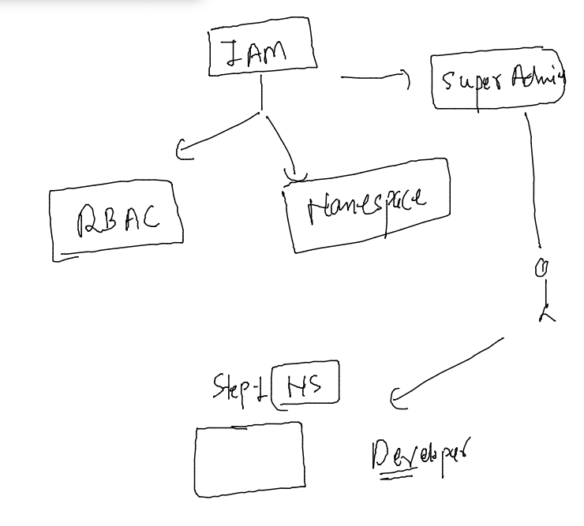
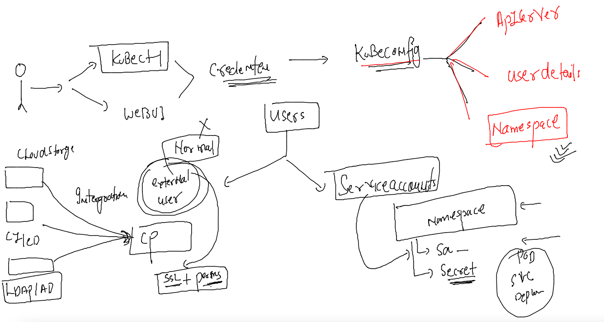
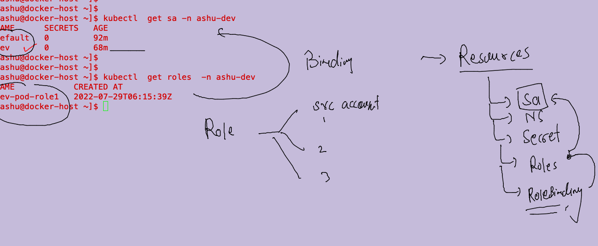
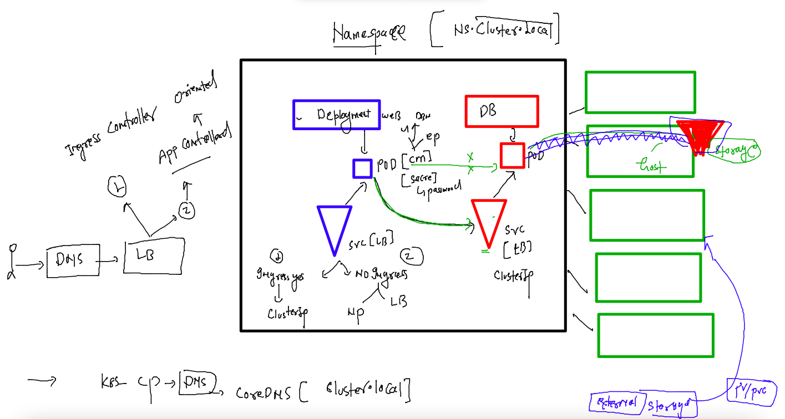
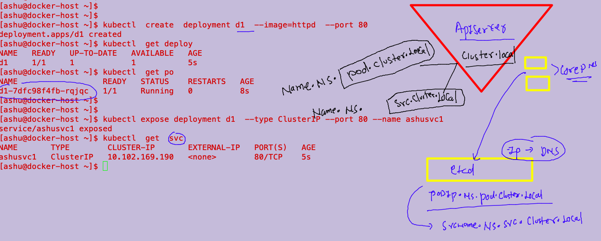

# Training plan 


## Understanding IAM in k8s for secuirty reason 



### few commands for super admin to see config admin.conf file 

```
kubectl config view 
kubectl  config  view --raw 
```

### create Namespace for Developer 

```
[ashu@docker-host ~]$ kubectl create  ns   ashu-dev 
namespace/ashu-dev created
[ashu@docker-host ~]$ kubectl  get  ns  --sort-by=.metadata.name 
NAME                   STATUS   AGE
abhi-apps              Active   47h
ashu-apps              Active   47h
ashu-dev               Active   18s

```

### understanding serviceaccoutns inside Namespace 



### by default everynamespace is having default service account 

```
[ashu@docker-host ~]$ kubectl  get  serviceaccounts -n ashu-dev 
NAME      SECRETS   AGE
default   0         21m
[ashu@docker-host ~]$ 
[ashu@docker-host ~]$ 
[ashu@docker-host ~]$ kubectl  get  sa -n ashu-dev 
NAME      SECRETS   AGE
default   0         21m

```

### we can also create your own service accounts 

```
[ashu@docker-host ~]$ kubectl  create   sa  dev   -n ashu-dev 
serviceaccount/dev created
[ashu@docker-host ~]$ 
[ashu@docker-host ~]$ kubectl  get  sa -n ashu-dev 
NAME      SECRETS   AGE
default   0         23m
dev       0         3s
```

### for token fo service account we need to create secret 

```
apiVersion: v1
kind: Secret
type: kubernetes.io/service-account-token
metadata:
  name: dev-secret # name of secret 
  namespace: ashu-dev 
  annotations:
    kubernetes.io/service-account.name: "dev" # name of serviceaccount 
```

====

```
[ashu@docker-host myimages]$ kubectl apply -f iam-k8s/sasecret.yaml 
secret/dev-secret created

[ashu@docker-host ~]$ kubectl  get  secrets -n ashu-dev 
NAME         TYPE                                  DATA   AGE
dev-secret   kubernetes.io/service-account-token   3      56s
```

### fetching token from secret 

```
kubectl -n ashu-dev describe secrets dev-secret 
Name:         dev-secret
Namespace:    ashu-dev
Labels:       <none>
Annotations:  kubernetes.io/service-account.name: dev
              kubernetes.io/service-account.uid: 7d403358-75f0-4251-84cf-6292e3b12978

Type:  kubernetes.io/service-account-token

Data
====
ca.crt:     1099 bytes
namespace:  8 bytes
token:      eyJhbGciOiJSUzI1NiIsImtpZCI6ImczdVNGUW1PTEJwREFxQXFHNHhPbVZ5cXczQ21mNTFQa25OZ2JXNjVvdmsifQ.eyJpc3MiOiJrdWJlcm5ldGVzL3NlcnZpY2VhY2NvdW50Iiwia3ViZXJuZXRlcy5pby9zZXJ2aWNlYWNjb3VudC9uYW1lc3BhY2UiOiJhc2h1LWRldiIsImt1YmVybmV0ZXMuaW8vc2VydmljZWFjY291bnQvc2VjcmV0Lm5hbWUiOiJkZXYtc2VjcmV0Iiwia3ViZXJuZXRlcy5pby9z
```

### lets test new token config file with new user 

```
fire@ashutoshhs-MacBook-Air ~ % ssh common-dev@129.146.109.58                   
common-dev@129.146.109.58's password: 
-bash: warning: setlocale: LC_CTYPE: cannot change locale (UTF-8): No such file or directory
[common-dev@docker-host ~]$ 
[common-dev@docker-host ~]$ 
[common-dev@docker-host ~]$ 
[common-dev@docker-host ~]$ 
[common-dev@docker-host ~]$ cp -v  /tmp/ashu-dev.conf  . 
'/tmp/ashu-dev.conf' -> './ashu-dev.conf'
[common-dev@docker-host ~]$ ls
ashu-dev.conf
[common-dev@docker-host ~]$ kubectl  get nodes  --kubeconfig  ashu-dev.conf 
Error from server (Forbidden): nodes is forbidden: User "system:serviceaccount:ashu-dev:dev" cannot list resource "nodes" in API group "" at the cluster scope
[common-dev@docker-host ~]$ ls
ashu-dev.conf  chan-dev.conf
[common-dev@docker-host ~]$ 
[common-dev@docker-host ~]$ kubectl  get pods   --kubeconfig  ashu-dev.conf 
Error from server (Forbidden): pods is forbidden: User "system:serviceaccount:ashu-dev:dev" cannot list resource "pods" in API group "" in the namespace "ashu-dev"
[common-dev@docker-host ~]$ kubectl  cluster-info    --kubeconfig  ashu-dev.conf 

To further debug and diagnose cluster problems, use 'kubectl cluster-info dump'.
Error from server (Forbidden): services is forbidden: User "system:serviceaccount:ashu-dev:dev" cannot list resource "services" in API group "" in the namespace "kube-system"
[common-dev@docker-host ~]$ ls
ashu-dev.conf  chan-dev.conf  pal-dev.conf
[common-dev@docker-host ~]$ 

```

### as we have seen we don't have any permission with this service account --

### role creation 

```
kubectl create role  dev-pod-role1 --resource=pods --verb=create --verb=get  --dry-run=client -o yaml >devsa-podrole1.yaml
```

## YAML file of role 

```
apiVersion: rbac.authorization.k8s.io/v1
kind: Role
metadata:
  creationTimestamp: null
  name: dev-pod-role1
  namespace: ashu-dev # roles are namespace dependent 
rules:
- apiGroups:
  - ""
  resources:
  - pods
  verbs:
  - create
  - get
  - list 

```

### 

```
[ashu@docker-host iam-k8s]$ kubectl apply -f  devsa-podrole1.yaml 
role.rbac.authorization.k8s.io/dev-pod-role1 created
[ashu@docker-host iam-k8s]$ kubectl get  roles -n ashu-dev 
NAME            CREATED AT
dev-pod-role1   2022-07-29T06:15:39Z
[ashu@docker-host iam-k8s]$ 

```

### importance of Rolebindings 



### creating rolebinding 

```
kubectl create rolebinding  dev-bind1 --role=dev-pod-role1  --serviceaccount=ashu-dev:dev  --dry-run=client -o yaml  >devsarolebind1.yaml 
```

### YAML 

```
apiVersion: rbac.authorization.k8s.io/v1
kind: RoleBinding
metadata:
  creationTimestamp: null
  name: dev-bind1
  namespace: ashu-dev # namespace info 
roleRef:
  apiGroup: rbac.authorization.k8s.io
  kind: Role
  name: dev-pod-role1
subjects:
- kind: ServiceAccount
  name: dev
  namespace: ashu-dev

```

### 

```
[ashu@docker-host iam-k8s]$ kubectl  apply  -f  devsarolebind1.yaml 
rolebinding.rbac.authorization.k8s.io/dev-bind1 created
[ashu@docker-host iam-k8s]$ 
[ashu@docker-host iam-k8s]$ kubectl  get roles -n ashu-dev 
NAME            CREATED AT
dev-pod-role1   2022-07-29T06:15:39Z
[ashu@docker-host iam-k8s]$ kubectl  get sa -n ashu-dev 
NAME      SECRETS   AGE
default   0         99m
dev       0         76m
[ashu@docker-host iam-k8s]$ kubectl  get rolebindings  -n ashu-dev 
NAME        ROLE                 AGE
dev-bind1   Role/dev-pod-role1   32s
```

### storage and app deployment in k8s 



### understanding Dns in k8s 



### DNS testing with DB and DB client 

### Deployment of Databases 

#### Creating CM 

```
kubectl create configmap  db-env --from-literal  MYSQL_USER="admin"    --dry-run=client -o yaml  >dbcm.yaml
====
apiVersion: v1
data:
  MYSQL_USER: admin
  MYSQL_DATABASE: oracle-info 
kind: ConfigMap
metadata:
  creationTimestamp: null
  name: db-env

```

### creating secret for password purpose 

```
apiVersion: v1
data:
  MYSQL_PASSWORD: RG9ja2VyQDEyMw==
  MYSQL_ROOT_PASSWORD: RG9ja2VyQDEyMw==
kind: Secret
metadata:
  creationTimestamp: null
  name: db-cred


```

### creating deployment 

```
 kubectl create deployment ashudb --image=mysql --port 3306 --dry-run=client -o yaml >dbdeploy.yaml 
 ====
 ==
 
apiVersion: apps/v1
kind: Deployment
metadata:
  creationTimestamp: null
  labels:
    app: ashudb
  name: ashudb
spec:
  replicas: 1 
  selector:
    matchLabels:
      app: ashudb
  strategy: {}
  template: # template for creating pods 
    metadata:
      creationTimestamp: null
      labels: # label of pods 
        app: ashudb
    spec:
      volumes: # creating volume dynamically 
      - name: ashudb-vol  
        hostPath: 
          path: /common/ashudb 
          type: DirectoryOrCreate # if above path is not available then create it
      containers:
      - image: mysql
        name: mysql
        ports:
        - containerPort: 3306
        envFrom: # reading env var directly 
        - secretRef: # using secret 
            name: db-cred
        - configMapRef: # using configMap 
            name: db-env
        volumeMounts: # adding above created volume to container 
        - name: ashudb-vol
          mountPath: /var/lib/mysql/ # default location for db store in MYSQL 
        resources: {}
      
status: {}

```
====

```
[ashu@docker-host k8s_final_demo]$ kubectl  get  cm 
NAME               DATA   AGE
db-env             2      32m
kube-root-ca.crt   1      41m
[ashu@docker-host k8s_final_demo]$ kubectl  get  secret
NAME      TYPE     DATA   AGE
db-cred   Opaque   2      32m
[ashu@docker-host k8s_final_demo]$ kubectl  get  deploy
NAME     READY   UP-TO-DATE   AVAILABLE   AGE
ashudb   1/1     1            1           95s
[ashu@docker-host k8s_final_demo]$ kubectl  get  po
NAME                      READY   STATUS    RESTARTS   AGE
ashudb-7db755b7cd-x2899   1/1     Running   0          102s
[ashu@docker-host k8s_final_demo]$ 

```
### creating service for Database 

```
ashu@docker-host ~]$ kubectl get deploy 
NAME     READY   UP-TO-DATE   AVAILABLE   AGE
ashudb   1/1     1            1           17m
[ashu@docker-host ~]$ kubectl expose deployment ashudb --type ClusterIP  --port 3306  --name dbserver 
service/dbserver exposed
```

### creating database client app to access 

```
 978  kubectl  create  deployment  db-client-app  --image=adminer  --port 8080 
  979  kubectl  get  deploy 
  980  kubectl  expose deployment db-client-app --type NodePort --port 8080 --name app
  981  kubectl  get  svc 
  982  history 
[ashu@docker-host ~]$ kubectl  get  svc
NAME       TYPE        CLUSTER-IP      EXTERNAL-IP   PORT(S)          AGE
app        NodePort    10.110.123.92   <none>        8080:30284/TCP   81s
dbserver   ClusterIP   10.99.225.9     <none>        3306/TCP         4m25s
```


