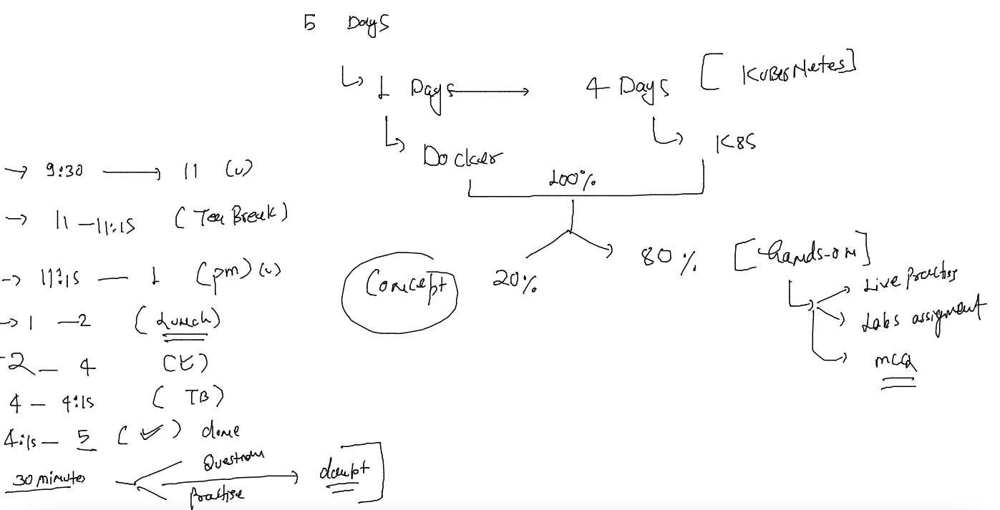
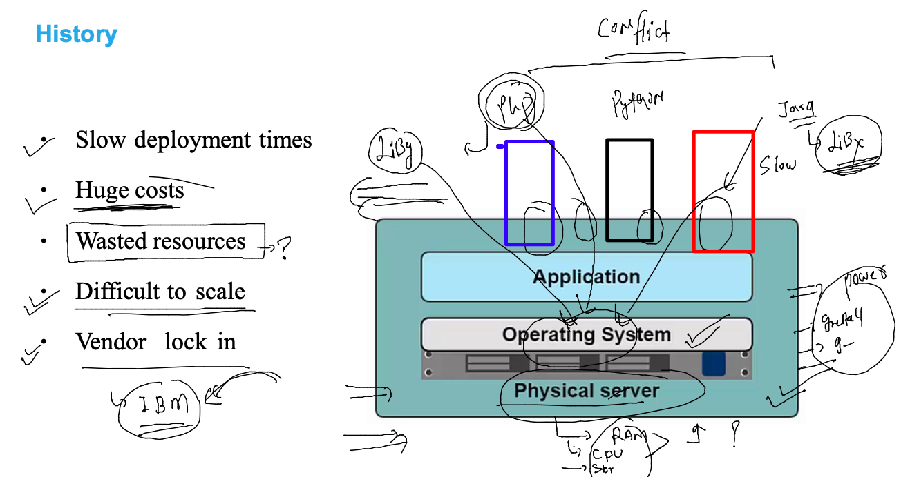
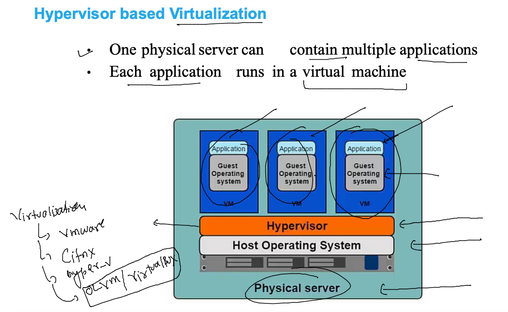
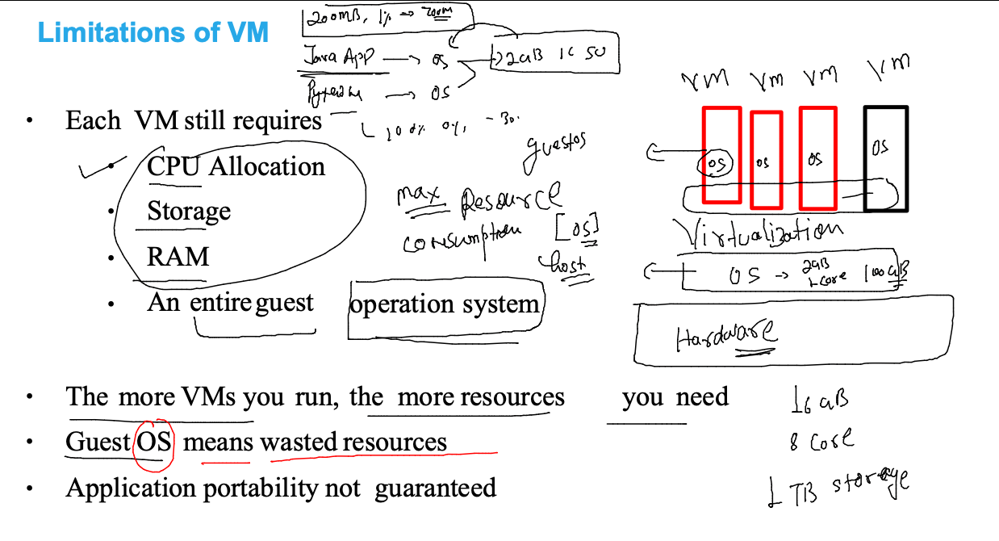
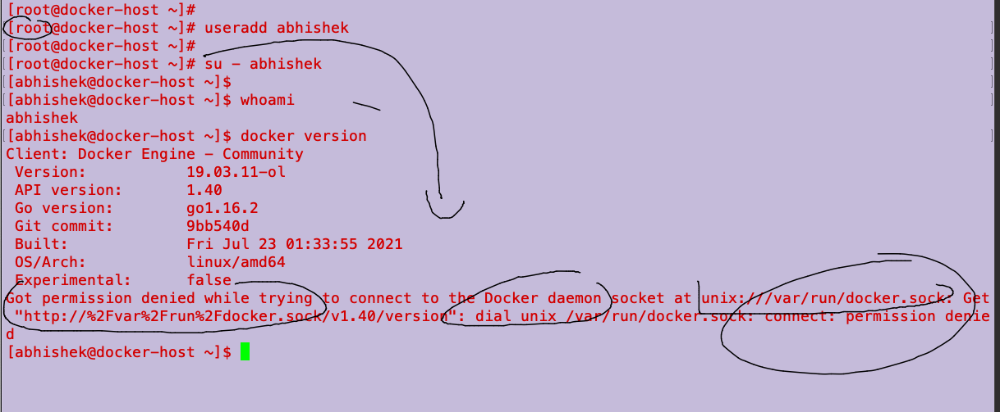
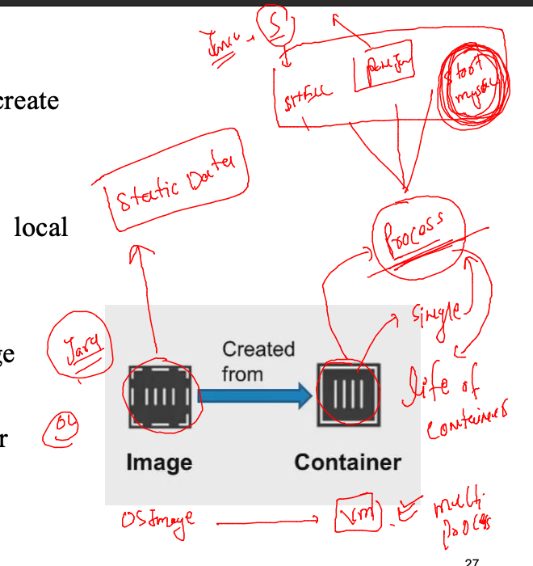
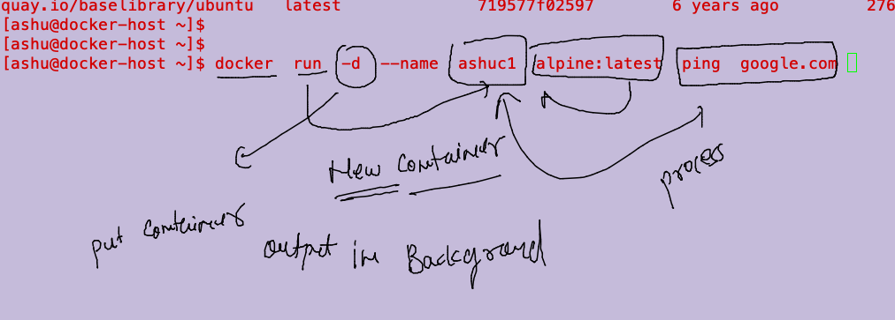
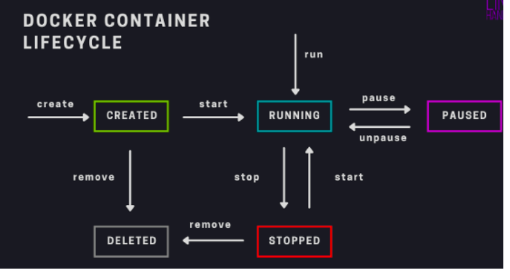

# Training plan 



### appilication incompatibility in bare-metal system 



### solution to app confict is Virtualization  -- Hypervisor



### virtualization is Good but Individual VM -- having os which is a problem 



### Introduction to containers 


### Installing docker on Oracle linux 7.9 in OCI 

```
[root@docker-host ~]# yum install  docker  
Failed to set locale, defaulting to C
Loaded plugins: langpacks, ulninfo
ol7_MySQL80                                                                           | 3.0 kB  00:00:00     
ol7_MySQL80_connectors_community                                                      | 2.9 kB  00:00:00     
ol7_MySQL80_tools_community                                                           | 2.9 kB  00:00:00     
ol7_UEKR6                                                                             | 3.0 kB  00:00:00     
ol7_addons                                                                            | 3.0 kB  00:00:00     
ol7_ksplice             
```

### starting docker daemon /service 

```
[root@docker-host ~]# systemctl start  docker 
[root@docker-host ~]# systemctl  enable   docker 
Created symlink from /etc/systemd/system/multi-user.target.wants/docker.service to /usr/lib/systemd/system/docker.service.
[root@docker-host ~]# systemctl  status    docker 
● docker.service - Docker Application Container Engine
   Loaded: loaded (/usr/lib/systemd/system/docker.service; enabled; vendor preset: disabled)
   Active: active (running) since Mon 2022-07-25 05:13:48 GMT; 13s ago
     Docs: https://docs.docker.com
 Main PID: 11824 (dockerd)
   CGroup: /system.slice/docker.service
           └─11824 /usr/bin/dockerd -H fd:// --containerd=/run/containerd/containerd.sock
```


### user based access 

### only root user is allowed to connect to docker server 

### non root users will show given error 



### fixing the problem by adding non root user to docker group 

```
[root@docker-host ~]# usermod -a  -G  docker  abhishek 
[root@docker-host ~]# 
[root@docker-host ~]# grep -i docker  /etc/group
docker:x:992:abhishek
[root@docker-host ~]# 
[root@docker-host ~]# 
[root@docker-host ~]# su - abhishek 
Last login: Mon Jul 25 05:15:34 GMT 2022 on pts/0
[abhishek@docker-host ~]$ whoami
abhishek
[abhishek@docker-host ~]$ docker  version 
Client: Docker Engine - Community
 Version:           19.03.11-ol
 API version:       1.40
 Go version:        go1.16.2
 Git commit:        9bb540d
 Built:             Fri Jul 23 01:33:55 2021
 OS/Arch:           linux/amd64
 Experimental:      false

Server: Docker Engine - Community
 Engine:
  Version:          19.03.11-ol
  API version:      1.40 (minimum version 1.12)
  Go version:       go1.16.2
  Git commit:       9bb540d
  Built:            Fri Jul 23 01:32:08 2021
  OS/Arch:          linux/amd64
  Experimental:     false
  Default Registry: docker.io
 containerd:
  Version:          v1.4.8
  GitCommit:        7eba5930496d9bbe375fdf71603e610ad737d2b2
 runc:
  Version:          1.1.1
  GitCommit:        52de29d
 docker-init:
  Version:          0.18.0
  GitCommit:        fec3683

```

### connecting as docker client 

```
fire@ashutoshhs-MacBook-Air ~ % ssh ashu@129.146.109.58
ashu@129.146.109.58's password: 
-bash: warning: setlocale: LC_CTYPE: cannot change locale (UTF-8): No such file or directory
[ashu@docker-host ~]$ 
[ashu@docker-host ~]$ 
[ashu@docker-host ~]$ 
[ashu@docker-host ~]$ docker  version 
Client: Docker Engine - Community
 Version:           19.03.11-ol
 API version:       1.40
 Go version:        go1.16.2
 Git commit:        9bb540d
 Built:             Fri Jul 23 01:33:55 2021
 OS/Arch:           linux/amd64
 Experimental:      false

Server: Docker Engine - Community
 Engine:
  Version:          19.03.11-ol
  API version:      1.40 (minimum version 1.12)
  Go version:       go1.16.2
  Git commit:       9bb540d
  Built:            Fri Jul 23 01:32:08 2021
  OS/Arch:          linux/amd64
  Experimental:     false
  Default Registry: docker.io
 containerd:
  Version:          v1.4.8
  GitCommit:        7eba5930496d9bbe375fdf71603e610ad737d2b2
 runc:
  Version:          1.1.1
  GitCommit:        52de29d
 docker-init:
  Version:          0.18.0
  GitCommit:        fec3683

```

### understanding docker image concept and pull docker image from docker hub to docker server 

```
[ashu@docker-host ~]$ docker  images
REPOSITORY          TAG                 IMAGE ID            CREATED             SIZE
[ashu@docker-host ~]$ docker pull mysql
Using default tag: latest
Trying to pull repository docker.io/library/mysql ... 
latest: Pulling from docker.io/library/mysql
e54b73e95ef3: Pull complete 
327840d38cb2: Pull complete 
642077275f5f: Pull complete 
e077469d560d: Pull complete 
cbf214d981a6: Pull complete 
7d1cc1ea1b3d: Pull complete 
d48f3c15cb80: Pull complete 
94c3d7b2c9ae: Pull complete 
f6cfbf240ed7: Pull complete 
e12b159b2a12: Pull complete 
4e93c6fd777f: Pull complete 
Digest: sha256:152cf187a3efc56afb0b3877b4d21e231d1d6eb828ca9221056590b0ac834c75
Status: Downloaded newer image for mysql:latest
mysql:latest
[ashu@docker-host ~]$ docker  images
REPOSITORY          TAG                 IMAGE ID            CREATED             SIZE
mysql               latest              33037edcac9b        11 days ago         444MB
[ashu@docker-host ~]$ 


```


### pulling more image 

```
[ashu@docker-host ~]$ docker images
REPOSITORY          TAG                 IMAGE ID            CREATED             SIZE
openjdk             latest              04bf630c9556        4 days ago          464MB
alpine              latest              d7d3d98c851f        6 days ago          5.53MB
mysql               latest              33037edcac9b        11 days ago         444MB
mongo               latest              c8b57c4bf7e3        5 weeks ago         701MB
oraclelinux         8.4                 97e22ab49eea        8 months ago        246MB
[ashu@docker-host ~]$ 

[ashu@docker-host ~]$ docker pull quay.io/libpod/ubuntu
Using default tag: latest
Trying to pull repository quay.io/libpod/ubuntu ... 
latest: Pulling from quay.io/libpod/ubuntu
da7391352a9b: Pull complete 
14428a6d4bcd: Pull complete 
2c2d948710f2: Pull complete 
Digest: sha256:c95a8e48bf88e9849f3e0f723d9f49fa12c5a00cfc6e60d2bc99d87555295e4c
Status: Downloaded newer image for quay.io/libpod/ubuntu:latest
quay.io/libpod/ubuntu:latest
[ashu@docker-host ~]$ 
[ashu@docker-host ~]$ docker  images
REPOSITORY              TAG                 IMAGE ID            CREATED             SIZE
openjdk                 latest              04bf630c9556        4 days ago          464MB
alpine                  latest              d7d3d98c851f        6 days ago          5.53MB
mysql                   latest              33037edcac9b        11 days ago         444MB
tomee                   latest              a3e6e1133a38        12 days ago         361MB
mongo                   latest              c8b57c4bf7e3        5 weeks ago         701MB
oraclelinux             8.4                 97e22ab49eea        8 months ago        246MB
quay.io/libpod/ubuntu   latest              f643c72bc252        20 months ago       72.9MB
[ashu@docker-host ~]$ 

```


### creating containers from images 

### importance of process in containers 



### creating our first container 



```
docker  run  -d  --name  ashuc1  alpine:latest  ping  google.com 

```

### listing running containers 

```
[ashu@docker-host ~]$ docker  ps
CONTAINER ID        IMAGE               COMMAND             CREATED             STATUS              PORTS               NAMES
b912115bf7ff        alpine              "ping google.com"   19 seconds ago      Up 18 seconds                           sahil1
13c6027adcbb        alpine:latest       "ping google.com"   24 seconds ago      Up 23 seconds                           gauravc1
cf4226260df8        alpine:latest       "ping oracle.com"   36 seconds ago      Up 34 seconds                           omeshs
6b6e2135be79        alpine:latest       "ping google.com"   2 minutes ago       Up 2 minutes                            ashuc1
```


### all the containers listing 

```
[ashu@docker-host ~]$ docker  ps  -a
CONTAINER ID        IMAGE               COMMAND             CREATED             STATUS                     PORTS               NAMES
8be37de02f2a        alpine:latest       "ping google.com"   31 seconds ago      Up 30 seconds                                  ayush2
9fe6ed99827f        alpine:latest       "ping google.com"   3 minutes ago       Up 3 minutes                                   eashu
dcba7ed6e1df        alpine:latest       "ping google.com"   4 minutes ago       Up 4 minutes                                   pallavi1
cf421ee95e66        alpine:latest       "ping google.com"   4 minutes ago       Up 4 minutes                                   var2
cd1355d28056        alpine:latest       "ping google.com"   4 minutes ago       Up 4 minutes                                   apoorvc1
420d8406f88c        alpine:latest       "ping google.com"   5 minutes ago       Up 5 minutes                                   abhishek
4ea07348afd3        alpine:latest       "date"              5 minutes ago       Exited (0) 5 minutes ago                       ayush1
```

### output of containers process 

```
 31  docker  logs  ashuc1
   32  docker  logs  -f  ashuc1
```

### accessing container shell and coming out 

```
[ashu@docker-host ~]$ docker  exec  -it  ashuc1  sh  
/ # 
/ # whoami
root
/ # ps  -e 
PID   USER     TIME  COMMAND
    1 root      0:00 ping google.com
    6 root      0:00 sh
   12 root      0:00 ps -e
/ # ifconfig  
eth0      Link encap:Ethernet  HWaddr 02:42:AC:11:00:02  
          inet addr:172.17.0.2  Bcast:172.17.255.255  Mask:255.255.0.0
          UP BROADCAST RUNNING MULTICAST  MTU:1500  Metric:1
          RX packets:825 errors:0 dropped:0 overruns:0 frame:0
          TX packets:796 errors:0 dropped:0 overruns:0 carrier:0
          collisions:0 txqueuelen:0 
          RX bytes:77890 (76.0 KiB)  TX bytes:75880 (74.1 KiB)

lo        Link encap:Local Loopback  
          inet addr:127.0.0.1  Mask:255.0.0.0
          UP LOOPBACK RUNNING  MTU:65536  Metric:1
          RX packets:0 errors:0 dropped:0 overruns:0 frame:0
          TX packets:0 errors:0 dropped:0 overruns:0 carrier:0
          collisions:0 txqueuelen:1000 
          RX bytes:0 (0.0 B)  TX bytes:0 (0.0 B)

/ # ls  /
bin    dev    etc    home   lib    media  mnt    opt    proc   root   run    sbin   srv    sys    tmp    usr    var
/ # exit

```
### more container 

```
 docker  stop  ashuc1
 docker  start  ashuc1
 [ashu@docker-host ~]$ docker  stop ashuc1
ashuc1
[ashu@docker-host ~]$ docker  rm  ashuc1
ashuc1

```

### container life cycle




