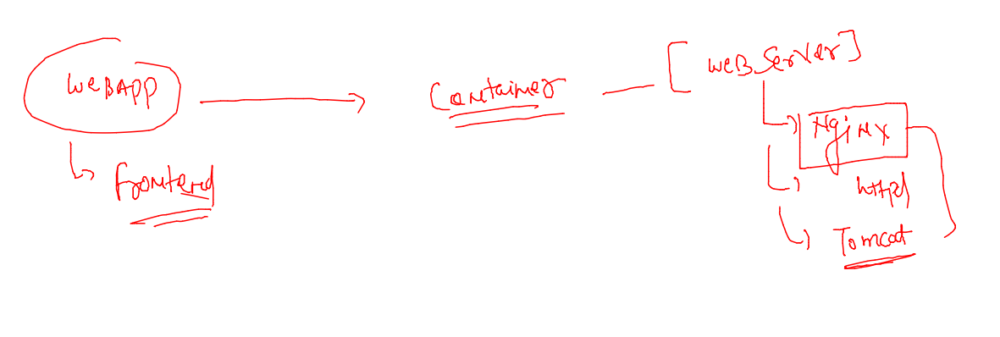
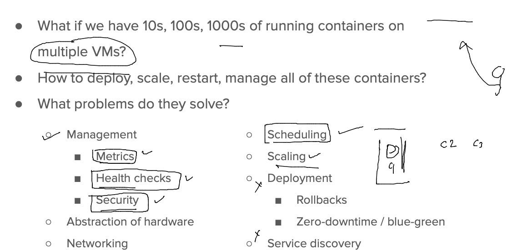
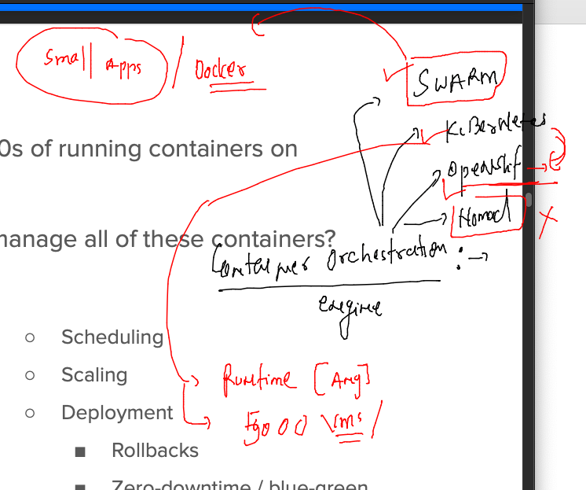
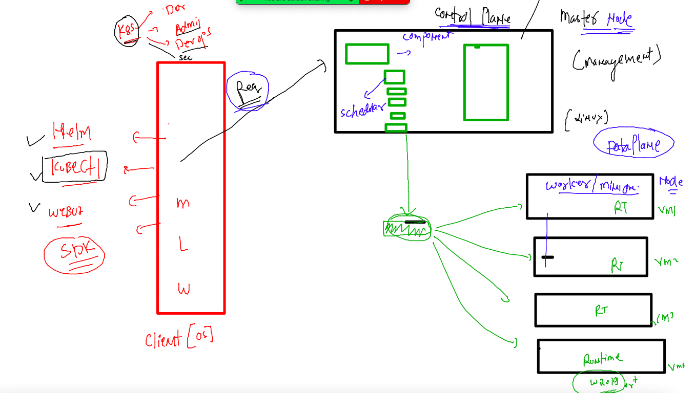
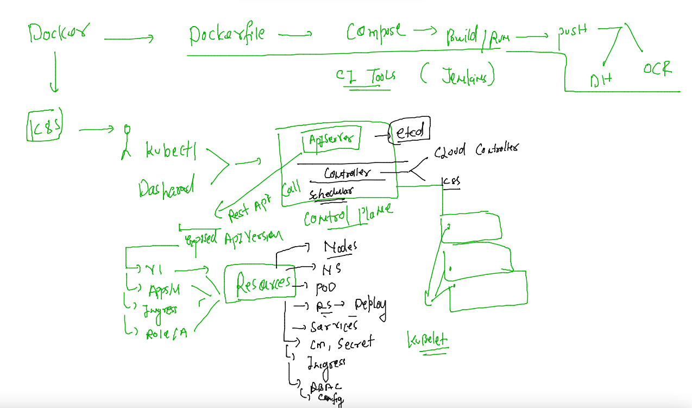
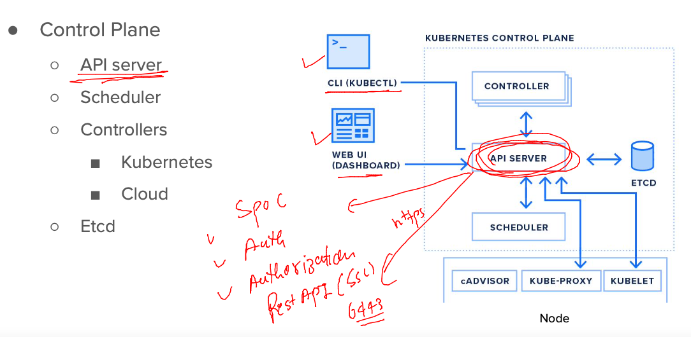

# Training plan 


### installing docker-compose tool for managing multiple containers 

```
[root@docker-host ~]# curl -SL https://github.com/docker/compose/releases/download/v2.7.0/docker-compose-linux-x86_64 -o /usr/bin/docker-compose 
  % Total    % Received % Xferd  Average Speed   Time    Time     Time  Current
                                 Dload  Upload   Total   Spent    Left  Speed
  0     0    0     0    0     0      0      0 --:--:-- --:--:-- --:--:--     0
100 24.5M  100 24.5M    0     0  12.1M      0  0:00:02  0:00:02 --:--:-- 24.1M
[root@docker-host ~]# 
[root@docker-host ~]# 
[root@docker-host ~]# chmod +x /usr/bin/docker-compose 
[root@docker-host ~]# 
[root@docker-host ~]# docker-compose version 
Docker Compose version v2.7.0

```

## writing compose file in YAML 

### compose example 1 

```
version: '3.8'
services:
  ashuapp1: # app
    image: alpine
    container_name: ashuc1
    command: ping fb.com 
  
```

### lets run a compose file 

```
[ashu@docker-host ashu-compose]$ ls
docker-compose.yaml
[ashu@docker-host ashu-compose]$ docker-compose up -d
[+] Running 2/2
 ⠿ Network ashu-compose_default  Created                                                     0.1s
 ⠿ Container ashuc1              Started                                                     0.2s
[ashu@docker-host ashu-compose]$ ls
docker-compose.yaml
[ashu@docker-host ashu-compose]$ docker-compose  ps
NAME                COMMAND             SERVICE             STATUS              PORTS
ashuc1              "ping fb.com"       ashuapp1            running             
[ashu@docker-host ashu-compose]$ 
```

### more operations 

```
[ashu@docker-host ashu-compose]$ docker-compose  ps
NAME                COMMAND             SERVICE             STATUS              PORTS
ashuc1              "ping fb.com"       ashuapp1            running             
[ashu@docker-host ashu-compose]$ docker-compose  stop 
[+] Running 1/1
 ⠿ Container ashuc1  Stopped                                                                10.4s
[ashu@docker-host ashu-compose]$ docker-compose  ps
NAME                COMMAND             SERVICE             STATUS              PORTS
ashuc1              "ping fb.com"       ashuapp1            exited (137)        
[ashu@docker-host ashu-compose]$ docker-compose  start
[+] Running 1/1
 ⠿ Container ashuc1  Started                                                                 0.5s
[ashu@docker-host ashu-compose]$ docker-compose  ps
NAME                COMMAND             SERVICE             STATUS              PORTS
ashuc1              "ping fb.com"       ashuapp1            running             
[ashu@docker-host ashu-compose]$ 
```

### using exec in compose 

```
[ashu@docker-host ashu-compose]$ docker-compose  exec  ashuapp1  sh 
/ # 
/ # 
/ # ls
bin    etc    lib    mnt    proc   run    srv    tmp    var
dev    home   media  opt    root   sbin   sys    usr
/ # exit
```

### clean up 

```
[ashu@docker-host ashu-compose]$ docker-compose  down 
[+] Running 2/2
 ⠿ Container ashuc1              Removed                                                    10.4s
 ⠿ Network ashu-compose_default  Removed                                                     0.1s
[ashu@docker-host ashu-compose]$ 
```
### example 2 

```
version: '3.8'
services:
  ashudbserver: # mydb db server container 
    image: mysql
    container_name: ashudbc1
    environment:
      MYSQL_ROOT_PASSWORD: "Docker@123#"
  dbclient: # webui client of DB 
    image: adminer
    container_name: ashudbclient
    ports: # left side port is for host expose so use any in range of 1024-2000
      - "1234:8080"
```

### lets run it 

```
[ashu@docker-host ashu-compose]$ ls
docker-compose.yaml  mysqldb.yaml
[ashu@docker-host ashu-compose]$ docker-compose -f mysqldb.yaml  up  -d
[+] Running 3/3
 ⠿ Network ashu-compose_default  Created                                                     0.1s
 ⠿ Container ashudbc1            Started                                                     0.9s
 ⠿ Container ashudbclient        Started                                                     1.0s
[ashu@docker-host ashu-compose]$ docker-compose -f mysqldb.yaml  ps
NAME                COMMAND                  SERVICE             STATUS              PORTS
ashudbc1            "docker-entrypoint.s…"   ashudbserver        running             3306/tcp, 33060/tcp
ashudbclient        "entrypoint.sh docke…"   dbclient            running             0.0.0.0:1234->8080/tcp
[ashu@docker-host ashu-compose]$ 


```

### Demo 3 

### webapp and web servers



```
[ashu@docker-host ashu-compose]$ mkdir  ashufrontend
[ashu@docker-host ashu-compose]$ ls
ashufrontend  docker-compose.yaml  khus.yaml  mysqldb.yaml
[ashu@docker-host ashu-compose]$ cd  ashufrontend/
[ashu@docker-host ashufrontend]$ git clone https://github.com/schoolofdevops/html-sample-app.git
bash: git: command not found
[ashu@docker-host ashufrontend]$ git clone https://github.com/schoolofdevops/html-sample-app.git
Cloning into 'html-sample-app'...
remote: Enumerating objects: 74, done.
remote: Total 74 (delta 0), reused 0 (delta 0), pack-reused 74
Unpacking objects: 100% (74/74), done.

====

[ashu@docker-host ashufrontend]$ ls  -a
.  ..  Dockerfile  .dockerignore  html-sample-app

===Dockerfile 

FROM nginx
LABEL name=ashutoshh
COPY html-sample-app  /usr/share/nginx/html/

=====>.dockerignore

html-sample-app/.git
html-sample-app/*.txt


====>docker-compose file 

version: '3.8'
services:
  ashufrontapp:
    image: ashuapp:frontv1 
    build:   # to call dockerfile 
      context: . # location of dockerfile 
      dockerfile: Dockerfile # name of dockerfile 
    container_name: ashuwb1
    ports:
      - "1234:80"
```

### running compose 

```
[ashu@docker-host ashu-compose]$ mkdir  ashufrontend
[ashu@docker-host ashufrontend]$ ls
docker-compose.yaml  Dockerfile  html-sample-app
[ashu@docker-host ashufrontend]$ docker-compose up --build -d 
[+] Building 6.5s (7/7) FINISHED                                                                  
 => [internal] load build definition from Dockerfile                                         0.0s
 => => transferring dockerfile: 172B                                                         0.0s
 => [internal] load .dockerignore                                                            0.0s
 => => transferring context: 141B                                                            0.0s
 => [internal] load metadata for docker.io/library/nginx:latest                              1.0s
 => [internal] load build context                                                            0.0s
 => => transferring context: 2.05MB        
```

### lets test and clean up 

```
[ashu@docker-host ashufrontend]$ docker-compose  ps
NAME                COMMAND                  SERVICE             STATUS              PORTS
ashuwb1             "/docker-entrypoint.…"   ashufrontapp        running             0.0.0.0:1234->80/tcp
[ashu@docker-host ashufrontend]$ docker-compose down 
[+] Running 2/2
 ⠿ Container ashuwb1             Removed                                                     0.5s
 ⠿ Network ashufrontend_default  Removed         
```

## Problems with Container in real world 



### Introduction to container orchestration 



### k8s a production by Google -- K8s architecture 



### preparing k8s client machine by installing kubectl 

```
[root@docker-host ~]# curl -LO "https://dl.k8s.io/release/$(curl -L -s https://dl.k8s.io/release/stable.txt)/bin/linux/amd64/kubectl"
  % Total    % Received % Xferd  Average Speed   Time    Time     Time  Current
                                 Dload  Upload   Total   Spent    Left  Speed
100   154  100   154    0     0    869      0 --:--:-- --:--:-- --:--:--   875
100 43.5M  100 43.5M    0     0  80.4M      0 --:--:-- --:--:-- --:--:--  417M
[root@docker-host ~]# 
[root@docker-host ~]# 
[root@docker-host ~]# ls
Dockerfile  Nodejs  kubectl  project-html-website
[root@docker-host ~]# mv kubectl /usr/bin/
[root@docker-host ~]# chmod +x /usr/bin/kubectl 
[root@docker-host ~]# 
[root@docker-host ~]# kubectl  version  --client 
WARNING: This version information is deprecated and will be replaced with the output from kubectl version --short.  Use --output=yaml|json to get the full version.
Client Version: version.Info{Major:"1", Minor:"24", GitVersion:"v1.24.3", GitCommit:"aef86a93758dc3cb2c658dd9657ab4ad4afc21cb", GitTreeState:"clean", BuildDate:"2022-07-13T14:30:46Z", GoVersion:"go1.18.3", Compiler:"gc", Platform:"linux/amd64"}
Kustomize Version: v4.5.4
[root@docker-host ~]# 
[root@docker-host ~]# 
[root@docker-host ~]# kubectl  version  --client  -o yaml 
clientVersion:
  buildDate: "2022-07-13T14:30:46Z"
  compiler: gc
  gitCommit: aef86a93758dc3cb2c658dd9657ab4ad4afc21cb
  gitTreeState: clean
  gitVersion: v1.24.3
  goVersion: go1.18.3
  major: "1"
  minor: "24"
  platform: linux/amd64
kustomizeVersion: v4.5.4


```

### k8s Infra setup understanding 



## k8s control plane components 

### apiserver 



### downlaod kube-apiserver -- auth token to connect from k8s client machine 

```
[root@control-plane ~]# cd  /etc/kubernetes/
[root@control-plane kubernetes]# ls
admin.conf
```

### sending first request to control plane -- APiserver 

```
[ashu@docker-host myimages]$ kubectl   cluster-info  

To further debug and diagnose cluster problems, use 'kubectl cluster-info dump'.
The connection to the server localhost:8080 was refused - did you specify the right host or port?
[ashu@docker-host myimages]$ ls
admin.conf  ashu-compose  golang  javacode  pythoncode  webapps
[ashu@docker-host myimages]$ kubectl   cluster-info   --kubeconfig admin.conf 
Kubernetes control plane is running at https://44.207.217.46:6443
CoreDNS is running at https://44.207.217.46:6443/api/v1/namespaces/kube-system/services/kube-dns:dns/proxy

To further debug and diagnose cluster problems, use 'kubectl cluster-info dump'.
[ashu@docker-host myimages]$ 

```

### --

```
[ashu@docker-host myimages]$ kubectl  get  nodes    --kubeconfig admin.conf 
NAME            STATUS   ROLES           AGE   VERSION
control-plane   Ready    control-plane   15m   v1.24.3
workernode1     Ready    <none>          14m   v1.24.3
workernode2     Ready    <none>          14m   v1.24.3
```

### copy admin.conf in default location from where kubectl can read 

```
[ashu@docker-host myimages]$ mkdir  ~/.kube 
mkdir: cannot create directory ‘/home/ashu/.kube’: File exists
[ashu@docker-host myimages]$ 
[ashu@docker-host myimages]$ cp -v  admin.conf   ~/.kube/config 
‘admin.conf’ -> ‘/home/ashu/.kube/config’
[ashu@docker-host myimages]$ 
[ashu@docker-host myimages]$ kubectl  get  nodes
NAME            STATUS   ROLES           AGE   VERSION
control-plane   Ready    control-plane   21m   v1.24.3
workernode1     Ready    <none>          19m   v1.24.3
workernode2     Ready    <none>          19m   v1.24.3
[ashu@docker-host myimages]$ 
```


